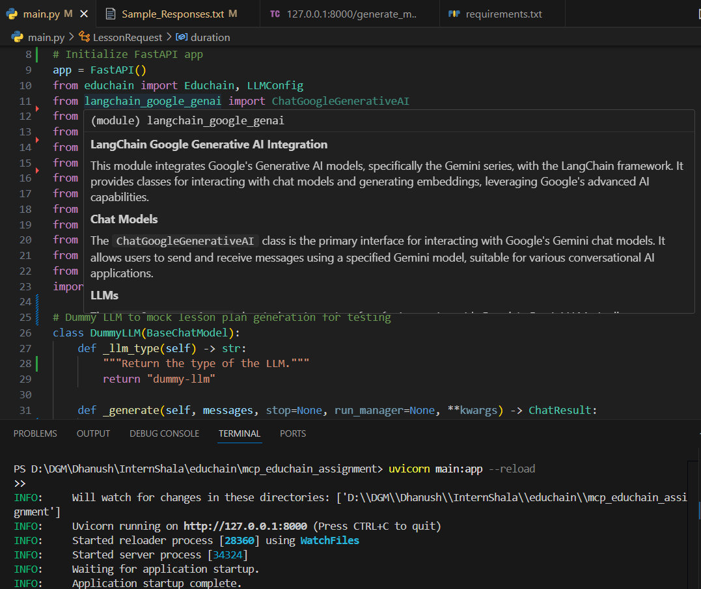
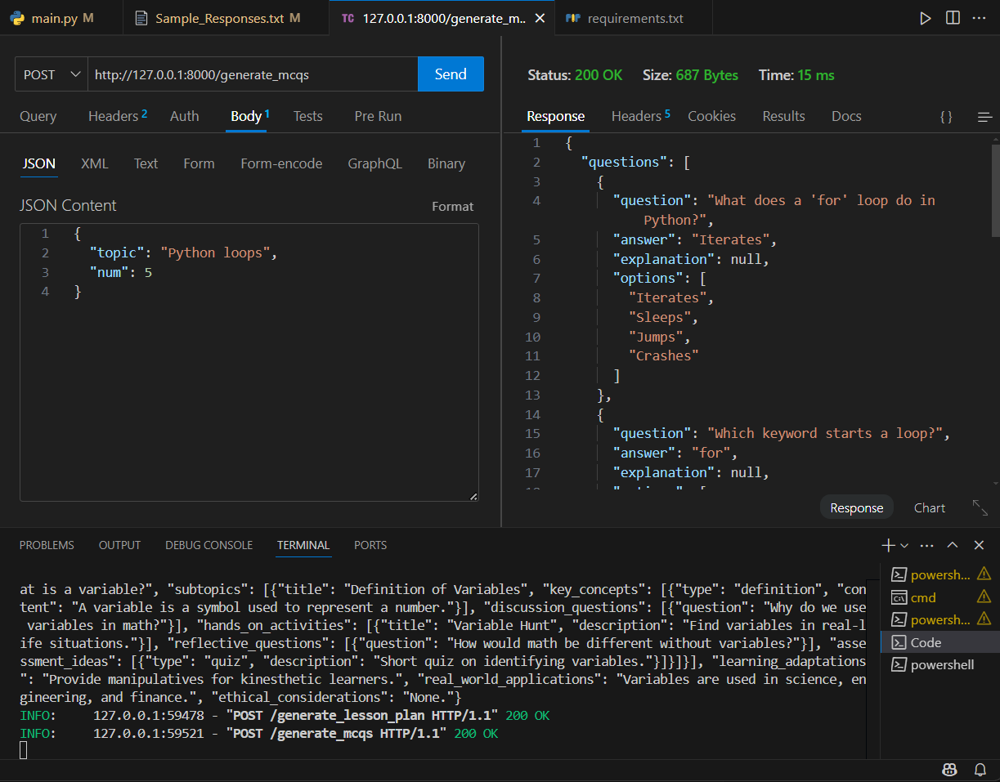
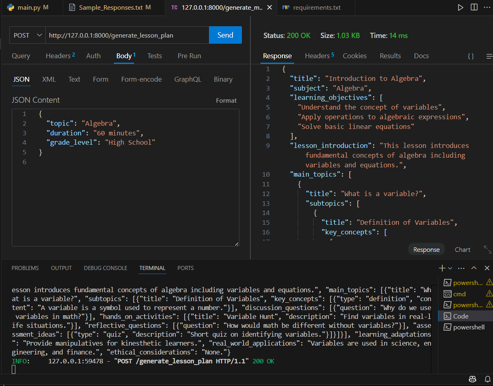

# EduChain MCP Assignment

## Overview
This project implements an MCP (Model Context Protocol) server using the [EduChain](https://github.com/satvik314/educhain) library. The server exposes endpoints to generate educational content such as lesson plans and multiple-choice questions (MCQs), designed for integration with Claude Desktop or other MCP-compatible clients.

## Features
- Generate comprehensive lesson plans for any topic.
- Generate multiple-choice questions (MCQs) for any topic.
- Easily extensible to add more educational tools/resources.
- Fully documented code with clear comments and citations.

## Setup Instructions

### 1. Clone the Repository
```
git clone https://github.com/dgm003/mcp_educhain_assignment.git
cd mcp_educhain_assignment 
```

### 2. Install Dependencies
It is recommended to use a virtual environment:
```
python -m venv venv
source venv/bin/activate  # On Windows: venv\Scripts\activate
pip install -r requirements.txt
```

### 3. Run the MCP Server
```
uvicorn main:app --reload
```
The server will start at `http://127.0.0.1:8000` by default.

## Usage

### Testing the Endpoints
You can test the endpoints using [Thunder Client](https://www.thunderclient.com/) (a VSCode extension for API testing), Postman, or any REST client of your choice.

**To use Thunder Client:**
- Install the Thunder Client extension in VSCode.
- Open the Thunder Client tab in VSCode.
- Create a new POST request to the desired endpoint (e.g., `http://127.0.0.1:8000/generate_lesson_plan`).
- Set the request body to JSON and provide the required fields (see examples below).
- Click "Send" to view the response.

### Endpoints
- `POST /generate_lesson_plan`  
  Generate a lesson plan for a given topic.
- `POST /generate_mcqs`  
  Generate multiple-choice questions for a given topic.

### Example Requests
#### Generate Lesson Plan
```
POST http://127.0.0.1:8000/generate_lesson_plan
Content-Type: application/json
{
  "topic": "Algebra",
  "duration": "60 minutes",
  "grade_level": "High School"
}
```

#### Generate MCQs
```
POST http://127.0.0.1:8000/generate_mcqs
Content-Type: application/json
{
  "topic": "Python loops",
  "num": 5
}
```

### Sample Responses
See `Sample_Responses.txt` for example outputs from the endpoints.

## Screenshots

### Terminal - FastAPI Server Running



### Thunder Client - Successful MCQ Response



### Thunder Client - Successful Lesson Plan Response



## Deliverables
- Python code with clear comments and documentation.
- Sample commands and responses (`Sample_Responses.txt`).
- This README file.

## Claude Desktop MCP Integration Note
> The public version of Claude Desktop (from [claude.ai](https://claude.ai/download)) does **not** currently support MCP server integration or custom tool configuration. As a result, direct integration and testing with Claude Desktop was not possible. All endpoints have been tested using Thunder Client (VSCode extension) and Postman. Please contact the assignment coordinator if an MCP-enabled build of Claude Desktop is required.

## Citations & References
- [EduChain library](https://github.com/satvik314/educhain)
- [EduChain documentation](https://github.com/satvik314/educhain#readme)
- [Model Context Protocol (MCP) Quickstart](https://modelcontextprotocol.io/quickstart/user)
- [FastAPI documentation](https://fastapi.tiangolo.com/)
- [LangChain documentation](https://python.langchain.com/)

All code is original except where noted, and external libraries are cited above.

## Contact
For any questions or guidance, please contact the assignment coordinators:
- prathmesh@buildfastwithai.com
- shubham@buildfastwithai.com 